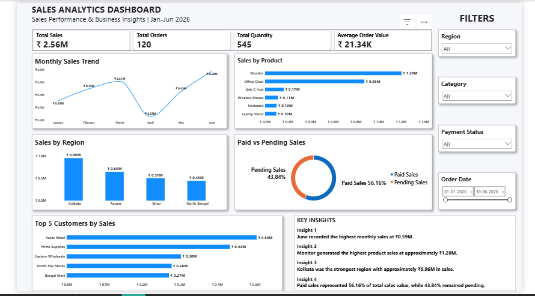

# 📊 Sales Analytics Dashboard — Power BI

An interactive **Sales Analytics Dashboard** built using **Microsoft Power BI, Power Query, and DAX** to analyze sales performance, customer behavior, product performance, regional performance, and payment status.

---

## 📌 Project Overview

This project demonstrates an end-to-end data analytics workflow, starting from raw sales data and transforming it into an interactive business intelligence dashboard.
## 🔗 Project Evolution

This project builds upon my earlier Excel-based Sales Analytics work.

The Excel project focused on data preparation, analysis, and initial business insights.

I then extended the analysis into Power BI by applying:

- Power Query for data transformation
- DAX for KPI calculations
- Interactive filters and slicers
- Dynamic business intelligence visualizations
- Automated analytical views

### Analytics Journey

Excel Analysis
↓
Data Cleaning & Preparation
↓
Power Query
↓
DAX Measures
↓
Power BI Dashboard
↓
Business Insights

This progression demonstrates how the same business problem can evolve from spreadsheet-based analysis into an interactive Business Intelligence solution.
### Workflow

**Raw Data → Data Cleaning → Power Query → DAX Measures → Data Visualization → Business Insights**

The dashboard analyzes sales performance for the period **January–June 2026**.

---

## 🛠️ Tools & Technologies

- **Microsoft Power BI**
- **Power Query**
- **DAX**
- **Microsoft Excel**
- Data Cleaning
- Data Transformation
- Data Visualization
- Business Intelligence

---

## 📁 Repository Structure

```text
sales-analytics-powerbi/
│
├── Dataset/
│   └── Cleaned_Sales_Data.xlsx
│
├── PowerBI/
│   └── Soumick_Sarkar_Sales_Analytics_Dashboard.pbix
│
└── Screenshots/
    ├── Dashboard_Analysis.png
    ├── Dashboard_Interactive_Filters.png
    └── Sales_Analytics_Dashboard.png
```

## 📊 Dashboard Preview


